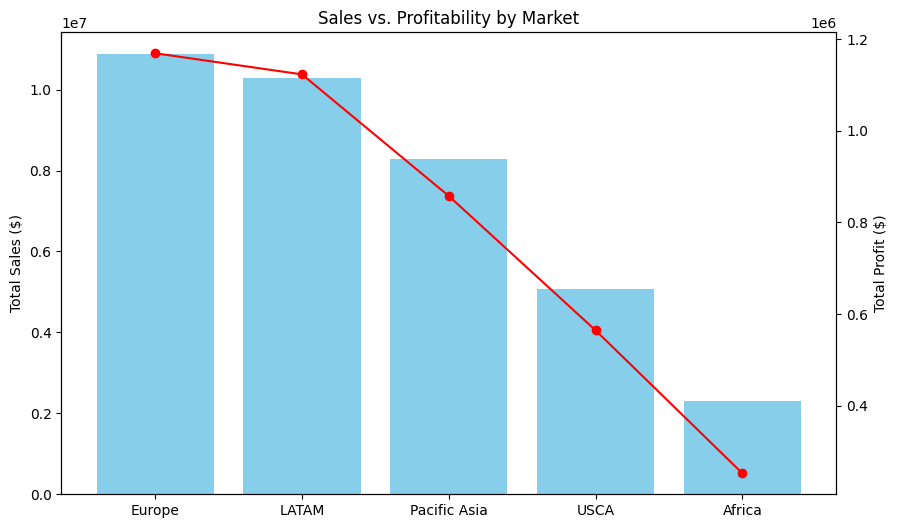
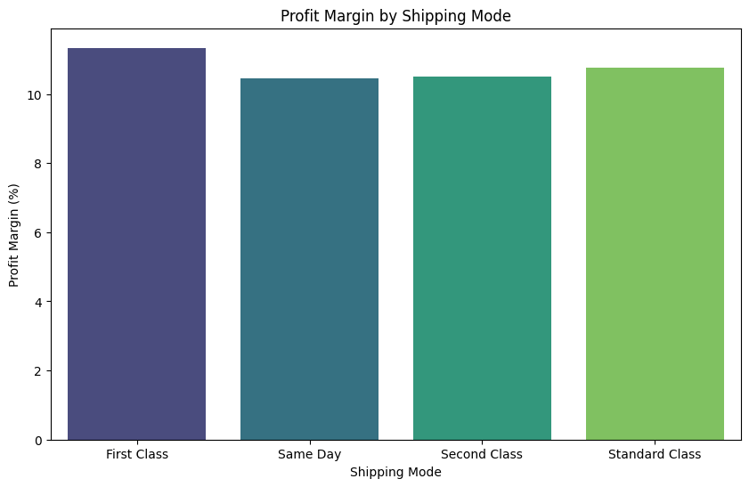
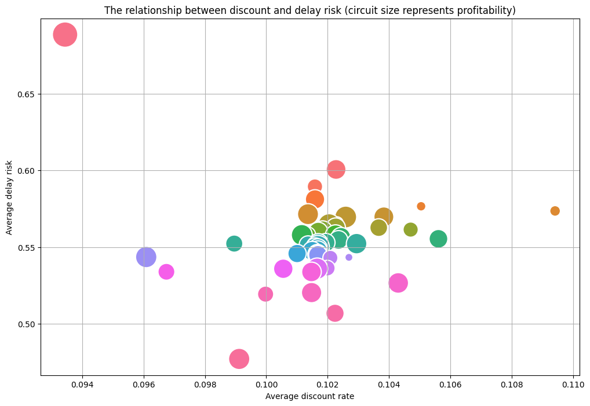
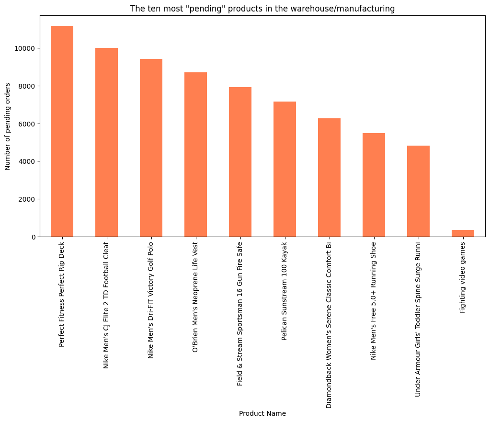
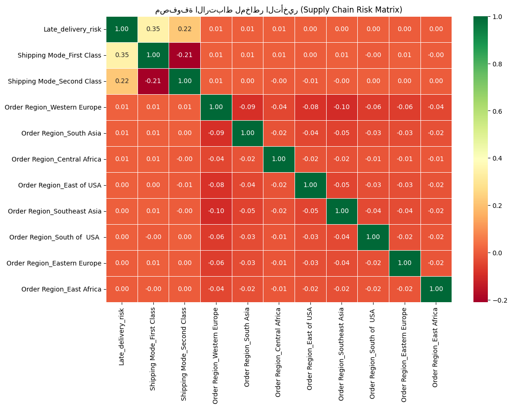

**Data-Driven Supply Chain Optimization: A Strategic Analysis of Resilience and Capital Flow Executive Summary**

This project transforms raw logistics data into actionable business intelligence by analyzing the Supply Chain Network—the interconnected structure of organizations and activities involved in delivering products to customers. Using Econometrics and Data Analytics, I identified critical bottlenecks freezing over $3.1M in capital. 

The objective was to achieve the "Golden Balance" in inventory planning to minimize costs while maximizing customer satisfaction.

**Core Components Analyzed**

The analysis focused on four interconnected components as defined in modern SCM frameworks:
**Inventory Planning:** Strategizing raw materials, work-in-progress, and finished goods to avoid both Stockouts and Excess Inventory.
**Sourcing & Manufacturing:** Evaluating supplier reliability, negotiating contracts, and production scheduling efficiency.
**Logistics & Distribution:** Optimizing transportation routes, warehouse capacity, and managing reverse logistics to reduce operational delays.
**Customer Service:** Monitoring key performance indicators (KPIs) to ensure high service levels and brand loyalty.

**Methodology**
A. Inventory EngineeringI applied the concepts of Safety Stock and Reorder Points to ensure the system can absorb "unexpected" demand shocks.
Safety Stock ($SS$):$$SS = Z \times \sigma_d \times \sqrt{LT}$$Reorder Point ($ROP$):$$ROP = (d \times LT) + SS$$
B. Risk Management & ResilienceTo build a resilient chain, I conducted a Vulnerability Analysis and Scenario Planning. This involved mapping the supply chain to identify critical links, such as heavy-product bottlenecks that disrupt picking productivity.

**Key Business Insights**
The "Cover-up" Phenomenon: Identified that high discounts are often used as a reactive measure to compensate for logistical failures and late deliveries.
Warehouse Bottlenecks: Heavy-duty items (e.g., Gun Safes) were identified as major bottlenecks, requiring a redesign of the Warehouse Layout or automated storage solutions to improve flow.
Logistics Reliability: Revealed that premium shipping modes (First Class) often suffer from high delay risks, necessitating Route Optimization

## 📊 Data Insights & Visualizations

### 1. Market Profitability Analysis

[cite_start]*Evaluating geographic performance to ensure operational profit and excellence[cite: 11].*

### 2. Logistics Efficiency & Shipping Modes

[cite_start]*Analyzing the gap between scheduled and real shipping days to improve delivery reliability.*

### 3. The Discount-Risk Correlation

[cite_start]*Identifying "Service Recovery" patterns where discounts mask logistical vulnerabilities[cite: 79].*

### 4. Warehouse Bottleneck Identification

[cite_start]*Visualizing frozen capital in pending orders to optimize warehouse layout and flow[cite: 60, 94].*

### 5. Risk Predictive Matrix

[cite_start]*Advanced visibility tool to predict and mitigate supply chain disruptions proactively[cite: 86, 110].*
